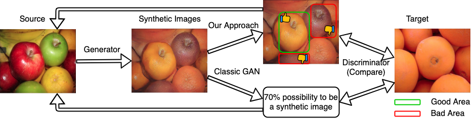

# Attention-Based Spatial Guidance for Image-to-Image Translation

pyTorch implementation of ["Attention-Based Spatial Guidance for Image-to-Image Translation"]() (WACV 2021).
The implementation is based on the official [CycleGAN](https://github.com/junyanz/pytorch-CycleGAN-and-pix2pix) code.
Our model and contribution are in `./models/attn_cycle_gan_model.py`, `./models/attn_cycle_gan_v2_model.py`




## Getting Started
### Installation

- Clone this repo:
```
git clone https://github.com/voidstrike/ASGIT
```

- Install requirement based on the official CycleGAN repo (Visdom and dominate). You can install them by
```
pip install -r requirements.txt
```

For CONDA users, you can use script `./scripts/conda_dep.sh` to install pytorch and other libraries (NOT tested)

### Download Datasets

Cityscapes dataset can be downloaded from [Cityscapes](https://www.cityscapes-dataset.com). You need to register an account to download the dataset.

Other datasets like apple2orange, horse2zebra, etc can be downloaded using `./scripts/download_cyclegan_model.sh`

### Run Experiments

- Train a model
```
python3 train_attn.py --netG resnet_9blocks --netD posthoc_attn --model attn_cycle_gan --concat rmult --dataroot DATASETPATH
python3 train_attn.py --netG resnet_9blocks --netD posthoc_attn_v2 --model attn_cycle_gan_v2 --concat alpha --dataroot DATASETPATH
python3 train_attn.py --netG resnet_9blocks --netD trainable_attn --model attn_cycle_gan --concat rmult --dataroot DATASETPATH
python3 train_attn.py --netG resnet_9blocks --netD trainable_attn_v2 --model attn_cycle_gan_v2 --concate alpha --dataroot DATASETPATH
```
- To view training results and and log plots, please run `python -m visdom.server` and go to URL http://localhost:8097.
- To see more intermediate results, check out `./checkpoints/NAME/web/index.html`

- Test a model
Just use the same command in the previous part and replace `train_attn.py` with `test.py`.

### Results
We provide some translation results of our model.

### SCENERY 


### OBJECT


